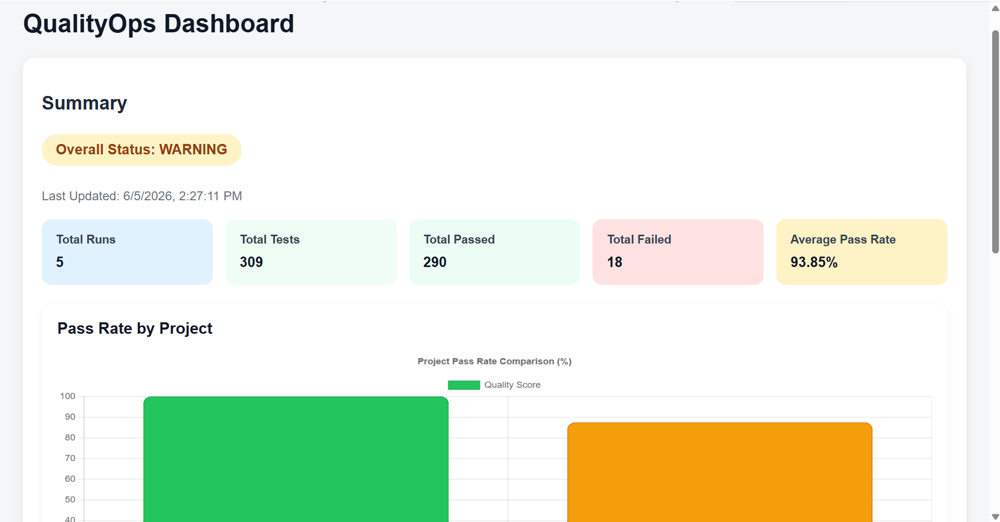
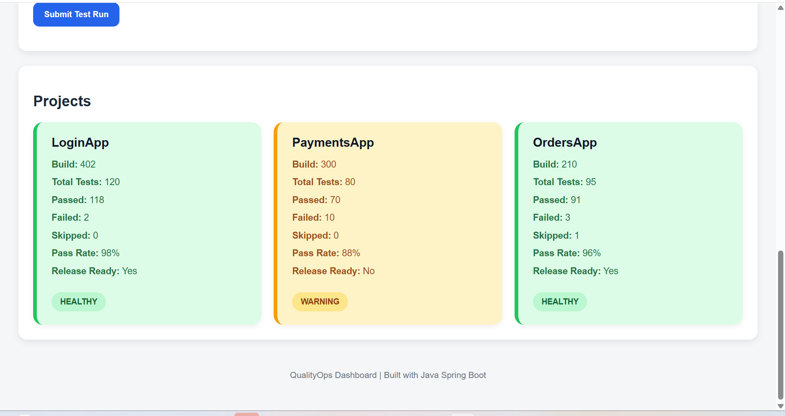

# QualityOps

QualityOps is a test analytics and release readiness dashboard built using Java, Spring Boot, H2 Database, HTML, CSS, and JavaScript.

### Workflow

1. Upload automated test execution report (JSON)
2. Process and validate test results
3. Store execution data in H2 Database
4. Calculate pass rates and readiness metrics
5. Display project health and analytics on the dashboard

## Live Demo

https://qualityops.onrender.com

### Dashboard Overview


### Project Health Monitoring



## Features

- Upload automated test execution reports using JSON
- Calculate pass rate, failed tests, skipped tests, and release readiness
- Dashboard with project health monitoring
- Visual quality comparison chart
- REST APIs for test management and reporting
- Automatic project status classification:
  - HEALTHY
  - WARNING
  - CRITICAL

## Technologies Used

- Java 17
- Spring Boot
- Spring Data JPA
- H2 Database
- HTML
- CSS
- JavaScript
- Chart.js
- Maven
- GitHub
- Tech Stack
- Thymeleaf
- Docker
- Render
## Architecture Overview

QualityOps follows a layered architecture using Spring Boot. Test execution reports are uploaded in JSON format through REST APIs, processed by the backend services, stored in an H2 database, and displayed through an interactive dashboard. The application calculates project health, pass rates, and release readiness metrics to support quality engineering decisions.
## Setup Instructions

### Clone Repository

```bash
git clone https://github.com/Amru-tha/qualityops.git
## Database

QualityOps uses an embedded H2 database for storing test execution results and project analytics.

Benefits:

- Lightweight
- No external installation required
- Fast local development
- Easy testing and demonstration

## API Endpoints

### Health Check

GET

```
/health
```

### Upload Test Report

POST

```
/upload-report
```

### Get Dashboard Data

GET

```
/dashboard
```

### Get All Test Runs

GET

```
/testruns
```

### Get Project Readiness

GET

```
/readiness/{projectName}
```

## Sample Report

```json
{
  "projectName": "LoginApp",
  "buildNumber": "402",
  "tests": [
    {
      "testName": "validLoginTest",
      "status": "PASS"
    },
    {
      "testName": "logoutTest",
      "status": "PASS"
    }
  ]
}
```
## Status Classification Rules

| Pass Rate | Status |
|------------|----------|
| 95% and above | HEALTHY |
| 85% - 94% | WARNING |
| Below 85% | CRITICAL |

Release readiness is calculated based on project pass rate and quality thresholds.
## Status Classification Rules

| Pass Rate | Status |
|------------|----------|
| 95% and above | HEALTHY |
| 85% - 94% | WARNING |
| Below 85% | CRITICAL |

Release readiness is calculated based on project pass rate and quality thresholds.


## Project Goal

This project simulates a Quality Engineering dashboard used by QA teams to monitor automated test execution results, analyze project quality trends, and evaluate release readiness before production deployment.

## Business Value

QualityOps helps QA teams:

- Monitor automated test execution results
- Evaluate release readiness
- Track project quality trends
- Identify high-risk releases before deployment
- Improve visibility for QA managers and stakeholders
## Challenges Solved

- Processed and analyzed automated test execution data from JSON reports
- Calculated project-level quality metrics and release readiness scores
- Designed a dashboard for visualizing quality trends and project health
- Integrated backend APIs with frontend dashboard components
- Implemented project status classification using quality thresholds
## Project Highlights

- Developed a full-stack Quality Engineering dashboard using Java Spring Boot
- Built REST APIs for test report ingestion and dashboard analytics
- Implemented project health monitoring and release readiness calculations
- Created interactive charts for quality trend visualization
- Processed JSON-based automated test execution reports
- Designed a responsive dashboard interface using HTML, CSS, and JavaScript
## Key Skills Demonstrated

- Java Programming
- Spring Boot Development
- REST API Design
- JSON Data Processing
- Test Analytics and Reporting
- Release Readiness Evaluation
- Frontend Development (HTML, CSS, JavaScript)
- Data Visualization with Chart.js
- Git and GitHub Version Control
- Quality Engineering Concepts
## Lessons Learned

Through this project, I gained hands-on experience with:

- Building REST APIs using Spring Boot
- Processing JSON data
- Creating dashboards using HTML, CSS, and JavaScript
- Visualizing data using Chart.js
- Working with H2 databases
- Managing source code using Git and GitHub
- Applying Quality Engineering concepts to software projects

## Future Enhancements

- User authentication and role management
- Historical trend analysis
- Email notifications for failed builds
- CI/CD integration with Jenkins and GitHub Actions
- Export dashboard reports to PDF

## Repository

GitHub Repository:
https://github.com/Amru-tha/qualityops
## Author

Amrutha Deeti

Master's Student – Information Technology Management  
QA Automation Engineer | Java | Selenium | Spring Boot | SQL


